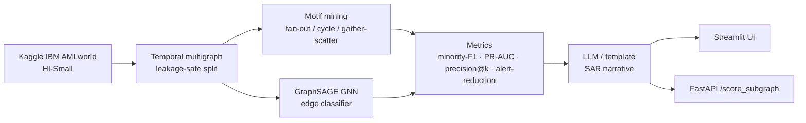

# AML-Graph

**Explainable money-laundering detection via quasi-temporal graph motifs — flag the ring, then explain it.**

[](https://github.com/OWNER/aml-graph/actions/workflows/ci.yml)
[](LICENSE)
[](https://www.python.org/)

> Replace `OWNER` in the badge URLs with the GitHub org/user once the repo is pushed.

## Problem

Money laundering hides in the *shape* of transaction flows — fan-outs,
gather-scatter chains and cycles — not in any single payment. Real prevalence is
~0.1%, so analysts drown in false positives and any flag they cannot explain is
useless for a Suspicious Activity Report (SAR).

## What it does

AML-Graph builds a temporal transaction multigraph, mines interpretable
laundering **motifs**, scores every edge with both a gradient-boosted baseline
and a Graph Neural Network, and produces an **auto-narrative** for each flagged
chain so an analyst gets a ready-to-review explanation, not just a number.

- **Leakage-safe temporal split** — train on the past, test strictly on the future.
- **Motif detectors** — fan-out, fan-in, cycle, gather-scatter, scatter-gather.
- **Two scorers** — LightGBM baseline (subprocess-isolated to dodge an OpenMP clash) and a GraphSAGE edge classifier.
- **Explainability** — a deterministic template narrative, upgradeable to a cached Anthropic Haiku call.
- **Demo surfaces** — a Streamlit tracer and a FastAPI `/score_subgraph` endpoint.

## Architecture



## Quickstart

```bash
# 1. Local dev environment (venv + deps)
make setup

# 2. Run the full pipeline: data -> graph -> models -> metrics -> figures
make experiment

# 3. Launch the demo (Docker if available, else local Streamlit)
make demo
#    or explicitly:
docker compose up demo     # Streamlit UI  -> http://localhost:8501
docker compose up api      # FastAPI       -> http://localhost:8000/docs
```

Secrets are read from the host environment only (never committed):

```bash
export ANTHROPIC_API_KEY=sk-...   # optional: enables LLM narratives
export KAGGLE_USERNAME=... KAGGLE_KEY=...   # optional: enables data download
```

## Results

Test set: 75,000 strictly-future edges, 2,304 illicit. Thresholds tuned for
best minority-F1; alert-reduction reported at fixed recall = 0.50.

| Model     | Minority-F1 | PR-AUC | Precision@100 | Alert reduction |
|-----------|:-----------:|:------:|:-------------:|:---------------:|
| **LightGBM** | **0.419**   | **0.379** | **1.00**      | **91.9%**       |
| GNN       | 0.248       | 0.189  | 0.71          | 86.5%           |
| Random    | 0.061       | 0.033  | 0.07          | 52.0%           |

The LightGBM baseline leads on this bounded sample; the GNN adds structural
signal and both dramatically outperform random triage. At recall 0.50 the
baseline lets analysts ignore ~92% of traffic.

> **Prevalence disclosure.** The MVP works on a bounded subsample and **keeps
> all positives**, inflating illicit prevalence to ~2% versus the true ~0.10%
> in the full dataset. Absolute precision figures are therefore optimistic; the
> *relative* model ranking and alert-reduction story hold.


## Repo layout

```
aml-graph/
├── src/                    # library code
│   ├── config.py           # paths, seeds, RunConfig / MotifWindows
│   ├── config_loader.py    # load configs/config.yaml -> RunConfig
│   ├── data_io.py          # Kaggle download + Patterns parser
│   ├── graph_build.py      # temporal multigraph construction
│   ├── splits.py           # leakage-safe temporal split
│   ├── motifs.py           # fan/cycle/gather-scatter detectors
│   ├── features.py         # EdgeDataset
│   ├── metrics.py          # minority-F1, PR-AUC, precision@k, alert-reduction
│   ├── baseline.py         # LightGBM (via subprocess) + lgbm_worker.py
│   ├── gnn.py              # GraphSAGE edge classifier
│   ├── narrative.py        # template + Anthropic Haiku narratives
│   ├── tracking.py         # optional MLflow logging (no-op if unset)
│   ├── viz.py              # 6 figures
│   └── pipeline.py         # run_mvp orchestration
├── app/
│   ├── streamlit_app.py    # interactive chain tracer
│   └── api.py              # FastAPI /score_subgraph + /health
├── tests/                  # motif + no-leakage tests (numpy+networkx only)
├── configs/config.yaml     # declarative run config
├── notebooks/mvp_aml.ipynb
├── outputs/                # figures + metrics.json (tracked)
├── Dockerfile              # reproducible CPU image (CUDA option commented)
├── docker-compose.yml      # demo + api services
├── dvc.yaml                # data/model pipeline stages
├── Makefile                # setup / lint / test / experiment / demo / api
└── .github/workflows/ci.yml# ruff + pytest + docker build
```

## AI usage

This MVP was built with AI-assisted engineering (Claude Code). What was
AI-assisted versus human-directed, and the driving prompts, are documented
honestly in [`docs/ai_usage.md`](docs/ai_usage.md).

## License

MIT.
