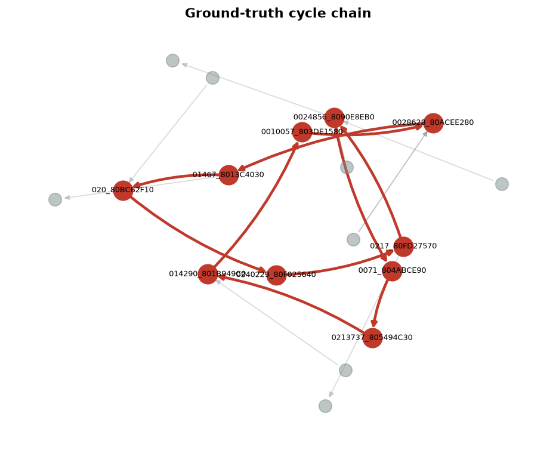
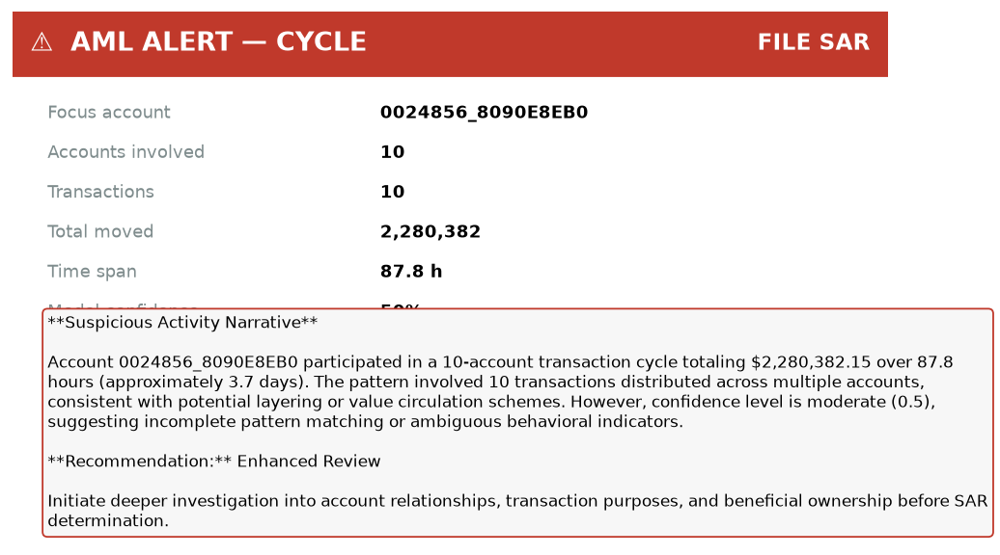
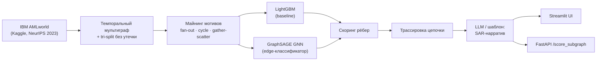
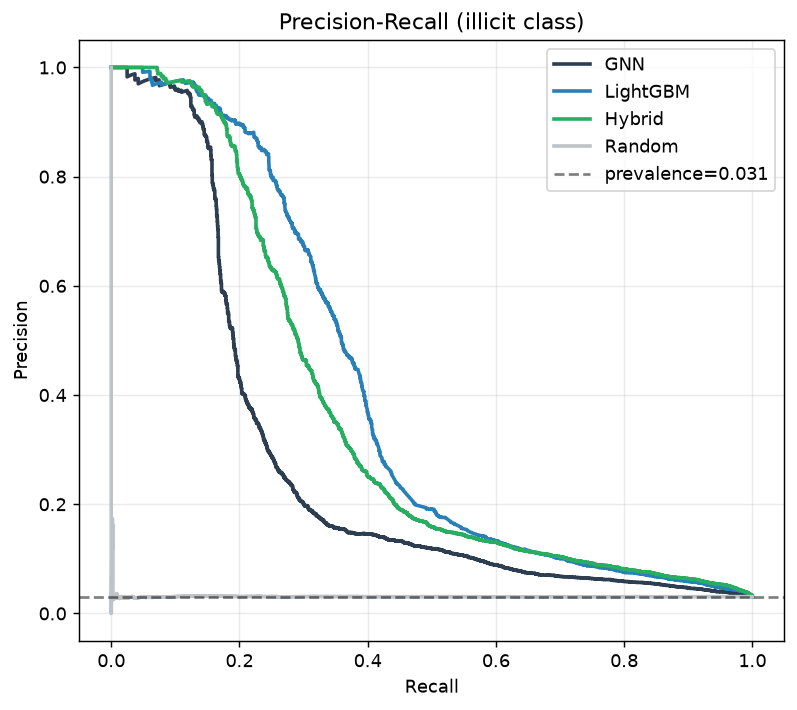

<div align="center">

# AML-Graph

**Объяснимое выявление схем отмывания денег на графе транзакций.**
Находим кольцо — подсвечиваем цепочку — отдаём готовое обоснование для SAR.

[](https://github.com/abdulovia/aml-graph/actions/workflows/ci.yml)
[](https://www.python.org/)
[](LICENSE)
[](docker-compose.yml)

 

*Слева — найденное кольцо из 10 счетов ($2.28M за 88 часов) на фоне обычного трафика.
Справа — автоматически собранная карточка-обоснование для комплаенс-аналитика.*

</div>

---

## Зачем это нужно

Банковский AML-мониторинг тонет в ложных срабатываниях: **90–95 % алертов — false positive**.
Правила смотрят на *отдельные* транзакции и не видят схему, размазанную по цепочке счетов
и по времени: веерный вывод на дропов (fan-out), кольца (cycle), дробление сумм (smurfing),
«собери-раздай» (gather-scatter). Аналитик часами вручную разматывает граф, а модели-чёрные-ящики
не дают формулировки, пригодной для отчёта регулятору (SAR).

**AML-Graph ставит на объяснимость**: каждый флаг привязан к конкретному графовому мотиву,
цепочку можно проверить ребро за ребром, а нарратив-обоснование генерируется автоматически.

## Что внутри

| Компонент | Что делает |
|---|---|
| 🕸 **Темпоральный мультиграф** | счёт = узел, платёж = направленное ребро со временем и суммой |
| 🔍 **Майнинг мотивов** | явные детекторы fan-out / fan-in / cycle / gather-scatter / scatter-gather (с юнит-тестами) |
| 🌲 **LightGBM baseline** | GBDT на интерпретируемых мотив-признаках — сильнейшая модель MVP |
| 🧠 **GNN (GraphSAGE)** | обучаемый скоринг рёбер: стандартизация, LayerNorm, early stopping, инференс без утечки |
| 📝 **LLM-объяснитель** | цепочка → SAR-нарратив (детерминированный шаблон или один кэшированный вызов Claude Haiku) |
| 🖥 **Демо-сервисы** | Streamlit-трейсер цепочек + FastAPI `POST /score_subgraph` |

## Быстрый старт (Docker)

```bash
git clone git@github.com:abdulovia/aml-graph.git && cd aml-graph
docker compose up -d
```

| Сервис | URL | Что там |
|---|---|---|
| Streamlit-демо | http://localhost:8501 | выбираешь счёт (отсортированы по риску) → подсвеченная цепочка + нарратив |
| FastAPI | http://localhost:8000/docs | `GET /health`, `POST /score_subgraph` |

Образ для сервинга — тонкий (без torch/lightgbm): демо читает заранее посчитанный
артефакт `data/processed/edges_scored.parquet`. Если артефакта нет — сервисы честно
скажут, как его получить (см. «Полный пайплайн» ниже).

<details>
<summary><b>Быстрый старт без Docker</b></summary>

```bash
make setup            # venv + зависимости
make experiment       # полный пайплайн: данные → граф → модели → метрики → фигуры
make demo             # Streamlit на :8501
make api              # FastAPI на :8000
```

Секреты только из окружения (в репозиторий не попадают):

```bash
export KAGGLE_API_TOKEN=...        # скачивание IBM AMLworld с Kaggle
export ANTHROPIC_API_KEY=sk-...    # опционально: LLM-нарративы вместо шаблона
```

</details>

## Как это работает



**Валидация — строго по времени.** Train / validation / test разрезаны по timestamp
(никаких случайных сплитов): порог F1 подбирается на валидации и **никогда — на тесте**,
message passing GNN видит только прошлое. Инвариант закреплён тестом
[`tests/test_no_leakage.py`](tests/test_no_leakage.py).

## Результаты

Данные: IBM AMLworld HI-Small (5.08 млн транзакций, ~0.1 % illicit, размеченные типологии).
MVP работает на подвыборке 250k рёбер со **всеми** illicit; тест — 75 000 строго более
поздних рёбер (2 304 illicit). Alert-reduction — при фиксированном recall = 0.5.

| Модель | Minority-F1 | PR-AUC | Precision@100 | Сокращение алертов |
|---|:---:|:---:|:---:|:---:|
| **LightGBM (мотивы)** | **0.409** | **0.368** | **1.00** | **91.3 %** |
| GNN (GraphSAGE) | 0.223 | 0.238 | 1.00 | 85.9 % |
| Random | 0.060 | 0.031 | 0.06 | 49.8 % |

<div align="center">

</div>

**Честный вывод MVP:** интерпретируемые мотив-признаки + LightGBM сильнее простого GNN —
это воспроизводит наблюдение IBM Graph Feature Preprocessor о силе рукотворных графовых
признаков. У обеих моделей топ-100 алертов — целиком настоящие: аналитик тратит время
не впустую, а поток на ручной разбор сокращается на ~91 %.

> **Дисклеймер о доле класса.** Подвыборка сохраняет все положительные примеры, поэтому
> доля illicit в ней ~3 % против истинных ~0.1 %. Абсолютные значения precision оптимистичны;
> порядок моделей и история про сокращение алертов сохраняются.

Все цифры воспроизводятся одной командой и лежат в [`outputs/metrics.json`](outputs/metrics.json).

## Полный пайплайн (обучение)

```bash
# локально (нужен KAGGLE_API_TOKEN для первого скачивания):
make experiment
# или через DVC:
dvc repro
# или в Docker (полный образ с torch/lightgbm):
docker build --target train -t aml-graph:train .
docker run --rm -v ./data:/app/data -v ./outputs:/app/outputs aml-graph:train \
  python -c "from src import pipeline; pipeline.run_mvp()"
```

Пайплайн скачает HI-Small, построит граф, обучит обе модели, посчитает метрики,
отрисует 6 фигур и запишет артефакт для демо.

## Структура репозитория

```
aml-graph/
├── src/                     # библиотека
│   ├── data_io.py           #   Kaggle-загрузка + парсер ground-truth паттернов
│   ├── graph_build.py       #   темпоральный мультиграф
│   ├── splits.py            #   tri-split по времени (без утечки)
│   ├── motifs.py            #   детекторы мотивов (fan/cycle/gather-scatter)
│   ├── features.py          #   EdgeDataset — рёберные признаки
│   ├── baseline.py          #   LightGBM (изолирован в сабпроцессе)
│   ├── gnn.py               #   GraphSAGE edge-классификатор
│   ├── metrics.py           #   minority-F1 · PR-AUC · precision@k · alert-reduction
│   ├── narrative.py         #   SAR-нарратив: шаблон + Claude Haiku (кэш)
│   └── pipeline.py          #   оркестрация run_mvp
├── app/
│   ├── streamlit_app.py     # интерактивный трейсер цепочек
│   └── api.py               # FastAPI /score_subgraph + /health
├── tests/                   # 16 тестов: мотивы, метрики, отсутствие утечки
├── notebooks/mvp_aml.ipynb  # ноутбук-нарратив пайплайна
├── docs/                    # описание проекта, слайды защиты, AI-usage
├── outputs/                 # 6 фигур + metrics.json (в git)
├── Dockerfile               # multi-stage: serve (тонкий) / train (полный)
├── docker-compose.yml       # demo + api с healthcheck'ами
├── dvc.yaml                 # download → run_mvp
└── .github/workflows/ci.yml # ruff + pytest + docker build
```

## Документация

| Документ | Что внутри |
|---|---|
| [`docs/description.md`](docs/description.md) | описание проекта (задача → данные → методы → результаты), ≤3 стр. |
| [`docs/slides.md`](docs/slides.md) | структура защитной презентации (10 слайдов) |
| [`docs/ai_usage.md`](docs/ai_usage.md) | честный разбор, что делалось с помощью AI-агентов |
| [`data/README.md`](data/README.md) | как получаются данные (Kaggle/DVC, в git не попадают) |

## Ограничения и планы

- **AMLworld синтетичен** — следующий шаг: кросс-домен на Elliptic.
- **GNN пока не обходит baseline** — в планах приёмы Multi-GNN (ego-IDs, темпоральная агрегация) и обучение на полном дисбалансе ~0.1 %.
- LightGBM с `n_jobs=2` не бит-детерминирован (F1 ±0.006 между прогонами) — для жёсткой воспроизводимости включите `deterministic=true` в `src/lgbm_worker.py`.

## Использование ИИ

MVP построен с применением AI-агентов (инженерия, эксперименты, LLM-нарратив как фича продукта).
Что именно делал ИИ, а что — человек, задокументировано в [`docs/ai_usage.md`](docs/ai_usage.md).

## Лицензия

[MIT](LICENSE)
